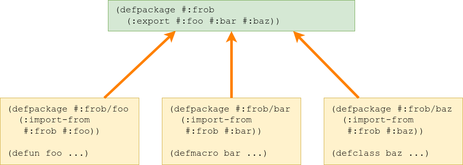
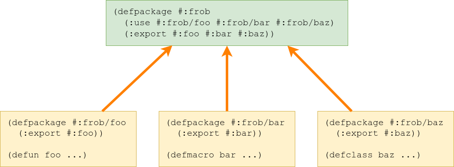

# `STATIC-LET`, Or How I Learned To Stop Worrying And Love `LOAD-TIME-VALUE`

## Introduction

So I have been working on Common Lisp Recipes, on a recipe for using global static bindings via [global-vars](https://github.com/lmj/global-vars). I was wondering if there was anything for *local* bindings though, something like in C:

```c
int test_function() {
  static int counter = 0;
  return counter++;
}

//test:
test_function(); // -> 0
test_function(); // -> 1
test_function(); // -> 2
```

And then, oh, I remembered. There was [an article](http://jacek.zlydach.pl/blog/2020-01-11-static-variables-in-common-lisp.html) exploring the topic and showing a technique that had some pretty nice syntax.

```lisp
CL-USER> (defun test-function ()
           (static-let ((counter 0))
             (incf counter)))
TEST-FUNCTION

CL-USER> (test-function)
1

CL-USER> (test-function)
2

CL-USER> (test-function)
3
```

Oh, and it should come in a `LET*` flavor too!

```lisp
CL-USER> (defun test-function-2 ()
           (static-let* ((counter 0)
                         (big-counter (+ counter 100)))
             (list (incf counter) (incf big-counter))))
TEST-FUNCTION-2

CL-USER> (test-function-2)
(1 101)

CL-USER> (test-function-2)
(2 102)

CL-USER> (test-function-2)
(3 103)
```

The only thing that was missing was a usable and somewhat tested implementation of that technique that I could link people to from the recipe. There wasn't one, though... So, d'oh, it needed to be written and uploaded somewhere.

Where? The library of [Serapeum](https://github.com/ruricolist/serapeum/) accepted the idea and I was able to come up with an [implementation](https://github.com/ruricolist/serapeum/pull/108). It satisfied the maintainer who also provided a few fixes, all of which are implemented in the article.

But, that's the boring stuff. Come! Let us indulge in a little bit of literate programming and figure out how exactly that code works.

## The idea

Before we dive into the details, let's first describe the general idea that we're going to use. In particular, let's describe the operator `LOAD-TIME-VALUE` and how it is useful in our particular use case.

And, since I don't want to keep you waiting, let's start with `TEST-FUNCTION` from above rewritten to use the same technique - just with less syntax sugar!

```lisp
CL-USER> (defun test-function ()
           (let ((counter-var (load-time-value (cons 0 nil))))
             (symbol-macrolet ((counter (car counter-var)))
               (incf counter))))
TEST-FUNCTION

CL-USER> (test-function)
1

CL-USER> (test-function)
2

CL-USER> (test-function)
3
```

OK, it seems to work the same. But, what's really going on here?

* We have bound a variable whose name is *not* `COUNTER` but some other symbol;
* We initialize that variable with a single cons cell whose `CAR` is `0`...
  * ...except that cons cell is defined to be a `LOAD-TIME-VALUE`,
* We define `COUNTER` to be a *symbol macro* which expands into a reference to the `CAR` of the value of the variable named by that other symbol,
* We increment `COUNTER` and return its new value.

And that's all the magical ingredients!

This approach is possible because of the magic of the special operator `LOAD-TIME-VALUE`. It's hard to explain its functioning in terms of other Common Lisp operators, which is also the reason why it is a special operator.

This operator *delays* the evaluation of some form until load-time. Once load-time happens (not any earlier, not any later), that form is evaluated, and then the whole `LOAD-TIME-VALUE` form is magically substituted with a reference to the object returned in the evaluation.

This way, once the piece of Lisp code in question is loaded, `LOAD-TIME-VALUE` disappears - and with it does the call to `CONS`. Instead, we get an already-created literal cons object, which is *additionally* free for us to modify - unlike e.g. a quoted cons literal like `'(0 . NIL)`. (This is because we did not supply the second argument to `LOAD-TIME-VALUE`, which allows us to create constant data.)

The load-time values become literally *spliced into* the code which uses them, they become an integral part of it - similarly to when one uses a closure. In fact, using closures is one of the alternative approaches of implementing a static binding described in the original article!

```lisp
CL-USER> (let ((counter 0))
           (defun test-function ()
             (incf counter)))
TEST-FUNCTION

CL-USER> (test-function)
1

CL-USER> (test-function)
2

CL-USER> (test-function)
3
```

The main difference between the two is based on syntax: a load-time value does not require a variable binding around function definition, whereas a closure requires that; in addition, `LOAD-TIME-VALUE` does not constitute a place, which is why we need to allocate a cons cell whose `CAR` we can then access.

In other words, it's *kinda possible* to think of a load-time value as an anonymous closure that is easily possible to use in a single place in code.

## Package definition

Okay, enough ideating! Let's start with actually making this thing a pleasure to use, and to take care of some additional functionalities that we'd like it to have. (And to shield us against misusing this tool.)

And start we shall, with the very basics. A good thing with implementing `STATIC-LET` is that we barely need *anything* that is not a part of standard Common Lisp in order to make it work - just a few utilities from Alexandria, one general utility and one declaration-related tool from Serapeum (we'll use this one at the very end to solve declaration issues), plus multithreading primitives from Bordeaux Threads. That is both a testament to how good ANSI CL is and a relief when it comes to pedagogy (no external dependencies, no problem!).

```lisp
(defpackage #:serapeum/static-let
  (:use #:cl)
  (:import-from #:alexandria
                #:required-argument
                #:once-only
                #:ensure-car
                #:deletef
                #:parse-body
                #:when-let
                #:mappens)
  (:import-from #:serapeum
                #:partition-declarations
                #:keep)
```

Still, it might be curious that we nonetheless import some other symbols from Serapeum. In fact, these are symbols with the same names as the ones we are supposed to define functionality for!

```lisp
  (:import-from #:serapeum
                #:recklessly-continue
                #:static-binding-flush-error
                #:static-binding-flush-error-group
                #:static-binding-flush-error-all-groups-p
                #:static-binding-active-error
                #:flush-static-binding-group
                #:flush-all-static-binding-groups
                #:static-let
                #:static-let*)
```

It turns out that we only import these symbols from Serapeum because we will *implement* them - that is, define new macros, condition types, functions named with these symbols, and therefore bring functionality to these symbols which are exported from Serapeum but do not yet have any useful stuff "attached" to them.



This is an inverse of the "usual" package management style in which `SERAPEUM/STATIC-LET` would export symbols which export some functionality and then some other package would import and reexport them in turn.



Again, it's hard to say which of these styles is the "norm"; both of them have their uses and they're equivalent in theory even if they require different styles of arranging code.

We could probably also do all of our work in package `SERAPEUM` as long as we sacrificed some brevity of our helper utilities' names, but eh, let's promote the one-package-per-file style wherever it's possible.

```lisp
  #+sbcl (:implement #:serapeum))
```

Here's a SBCL-specific tidbit. SBCL implements the concept of *package locking* which is meant to prevent the specific thing that we are attempting to do here - meddling with a package's symbols from the outside. Serapeum makes use of that functionality and its package is locked on SBCL.

Here, however, meddling with Serapeum's symbols *is the whole point* of what we're trying to do - hence, we need to mark `SERAPEUM/STATIC-LET` as an *implementation package* for `SERAPEUM`. This allows us to define new functionality on Serapeum's symbols without tripping the package lock.

```lisp
(in-package #:serapeum/static-let)
```

We're all set package-wise, then; let's go!

## Static binding structure

The code from the original article uses a cons cell rather than a whole structure, and also does not recognize between an uninitialized binding and an initialized binding with the value of `NIL`. It also isn't safe against the situation of multiple threads attempting to initialize the binding at the same time.

To fix that, we'll implement each static binding as a structure with three slots: the value (obviously), a boolean stating whether a binding has been initialized, and an optional lock for bindings which should work in a multithreaded environment. We don't need a copier or a predicate and, since we're in our own package, we can ignore prefixes for accessors.

```lisp
(defstruct (static-binding (:constructor %make-static-binding)
                           (:copier nil)
                           (:predicate nil)
                           (:conc-name #:||))
  (value nil :type t)
  (initializedp nil :type boolean)
  (lock nil :read-only t :type (or null bt:lock)))
```

A keen eye will notice that we've defined a private constructor, `%MAKE-STATIC-BINDING`: that is because we want to make the lock optional (depending on the value of a constructor argument) and later conditionalize our code based on whether the lock exists (and the lock should therefore be acquired before proceeding with modifying the binding).

```lisp
(defmacro value-ref (static-binding)
  `(value ,static-binding))

(define-setf-expander value-ref (name)
  (error "Cannot mutate a ~S binding: ~S" 'static-let name))
```

This code is here to make the static bindings themselves immutable to guard against the interaction between `STATIC-LET` and other macros. In particular, it's possible for one person to write a macro that creates a static binding and for another person to not understand how the binding is different from a regular binding.

*(It's a thing I'm not fully satisfied with, but then again, it's not a big problem in practice. [Here](https://github.com/ruricolist/serapeum/issues/112) is a GitHub issue related to this.)*

```lisp
(defun make-static-binding (&key once)
  (%make-static-binding
   :lock (if once (bt:make-lock "Static binding lock") nil)))
```

## Conditions

The original article describes a particular trait of static bindings: their values are effectively inaccessible from the outside. This behavior is useful for e.g. static data which is meant for persist across deploying a Lisp application by saving the Lisp image and restoring it later, but it's unnecessary for e.g. any kind of caches that such static values might be used for: they will unnecessarily inflate the size of the binary and should instead be re-instantiated when the image is restored.

This means that we need some way to be able to flush these bindings from the outside. And such an operation is dangerous, because it's essentially equivalent to being able to pull the rug from under a series of threads that may be currently standing on it.

So, we need the ability to signal an error to raise the programmer's awareness about this danger, and to make the error continuable if the programmer decides that this is what they want.

Let's get to work, then!

### Condition helpers

We'll start by defining a helper function that will provide us with substrings that we will use generously over our condition and restart reports. We do that to avoid code duplication.

```lisp
(defun report-group-substring (&key group all-groups-p)
  (format nil "~:[static bindings from group ~S~;ALL static bindings~]"
          all-groups-p group))
```

These strings, `"static bindings from group ~S"` and `"ALL static bindings"`, will be useful both in the error report and the report for the `CONTINUE` and `RECKLESSLY-CONTINUE` restarts that we will want to establish.

Wait, `RECKLESSLY-CONTINUE`?

```lisp
(defun recklessly-continue (&optional condition)
  (when-let ((restart (find-restart 'recklessly-continue condition)))
    (invoke-restart restart)))
```

Yep - we will establish such a restart, for when the standard `CONTINUE` restart is too risky to be used. We will encounter such a situation soon.

### Flush error

```lisp
(define-condition static-binding-flush-error (error)
  ((group :initarg :group
          :reader static-binding-flush-error-group)
   (all-groups-p :initarg :all-groups-p
                 :reader static-binding-flush-error-all-groups-p))
  (:default-initargs :group nil :all-groups-p nil)
  (:report report-static-binding-flush-error))
```

We need to be able to pass two bits of information along with the condition. One is the *group* that a binding is a part of (if the user wants to flush just a single group of bindings), the other is whether the user instead wants to flush bindings for *all* groups - including, possibly, the ones that they didn't define themself.

It's a little bit peculiar that the two slots, `GROUP` and `ALL-GROUPS-P`, both have `NIL` as their initial value. That's because we use two slots instead of overloading a single slot, in order to follow [Pitman's Two-Bit Rule](http://www.nhplace.com/kent/PS/EQUAL.html):

>     ``If you have two bits of information to represent,
>        use two bits to represent it.
>      Neither coincidence nor convenience 
>        justifies overloading a single bit.''
>
>                -- Pitman's Two-Bit Rule

We need a report for our condition, and a report for the `CONTINUE` restart that will need to be established around it. Let's start with a useful helper function that we'll use in both of them.

```lisp
(defun report-static-binding-flush-error (condition stream)
  (let* ((group (static-binding-flush-error-all-groups-p condition))
         (all-groups-p (static-binding-flush-error-group condition))
         (substring (report-group-substring :group group
                                            :all-groups-p all-groups-p)))
    (format stream
            "Requested to flush all values for ~A and ~
             to restore them to their uninitialized state.~@
             This operation is unsafe to perform while any other ~
             threads are trying to access these bindings.~:[~@
             Remove this error message with :ARE-YOU-SURE-P T.~;~]"
            substring all-groups-p)))
```

Here's a proper condition report with an appropriately scary error message.

The latter part about `:ARE-YOU-SURE-P T` is conditional, only to be shown if the programmer wants to flush a single group of bindings. That's because we only want to provide the keyword argument `ARE-YOU-SURE-P` in case of flushing a single group, which is something that the programmer can claim to be able to control - e.g. when they have made sure that all worker threads are stopped and will not access the bindings from that group.

Doing the same to all groups is too dangerous and therefore we assume that the programmer will *never* be sure if it's OK to flush all the bindings.

```lisp
(defun static-binding-flush-error (&optional (group nil groupp))
  (let* ((condition (make-condition 'static-binding-flush-error
                                    :group group :all-groups-p (not groupp)))
         (continue-string
           (format nil "Flush values for ~A."
                   (report-group-substring :group group
                                           :all-groups-p (null groupp)))))
    (cerror continue-string condition)))
```

We finish off with a custom signaling function which piggybacks on top of `CL:CERROR` in order to establish a continuable error, supplying our custom restart report and an instance of `STATIC-BINDING-FLUSH-ERROR` to it.

### Active binding error

There is one more situation in which we might want to signal an error, though: a situation in which we flush a static binding *while it is active*. Consider a situation like this:

```lisp
CL-USER> (static-let ((x 42 :in 'foo))
           (flush-static-binding-group :are-you-sure-p t)
           x) ; no longer an integer, but NIL!
```

This can also bite us in dynamic scope:

```lisp
CL-USER> (flet ((foo () (flush-static-binding-group :are-you-sure-p t)))
           (static-let ((x 42 :in 'foo))
             (foo)
             x)) ; no longer an integer, but NIL!
```

In particular, we make a new binding in group `FOO`, and then, while that binding is active, we flush its value. In the best case, we this will return `NIL`; in the worst case, if `:TYPE` option is in effect, we are invoking undefined behavior!

```lisp
CL-USER> (static-let ((x 42 :in 'foo :type integer))
           (flush-static-binding-group :are-you-sure-p t)
           (+ x 10)) ; UB, the value of X is no longer an INTEGER
```

We will need to guard against such a situation by signaling a proper condition. We could think about signaling `STATIC-BINDING-FLUSH-ERROR` as well, except such a case of attempting to flush a currently active binding also warrants for inheriting from `PROGRAM-ERROR`.

So, multiple inheritance for the win! The situation in which we will signal that condition is so similar to the previous case - except we are *sure* that the *current* thread may be affected by it - that our new condition may inherit from `STATIC-BINDING-FLUSH-ERROR` and `PROGRAM-ERROR` alike.

```lisp
(define-condition static-binding-active-error (static-binding-flush-error
                                               program-error) ()
  (:default-initargs :group (required-argument :group))
  (:report report-static-binding-active-error))
```

A mentionworthy thing is that this condition requires the programmer to specify the binding group - which is easy, since the code will always know the group that is active.

Let us make a properly scary report, also making use of the previously defined `REPORT-GROUP-SUBSTRING` function...

```lisp
(defun report-static-binding-active-error (condition stream)
  (let* ((group (static-binding-flush-error-all-groups-p condition))
         (all-groups-p (static-binding-flush-error-group condition))
         (substring (report-group-substring :group group
                                            :all-groups-p all-groups-p)))
    (format stream
            "Requested to flush all values for ~A and ~
             to restore them to their uninitialized state, ~
             but a binding from group ~S is currently active.~@
             This can cause undefined behavior if any of the ~
             bindings is accessed again before it is reinitialized."
            substring group)))
```

...and a signaling function which will establish the `RECKLESSLY-CONTINUE` restart we have mentioned earlier.

```lisp
(defun static-binding-active-error (group &optional all-groups-p)
  (let ((condition (make-condition 'static-binding-active-error
                                   :group group :all-groups-p all-groups-p))
        (continue-string
          (format nil "Flush values for ~A."
                  (report-group-substring :group group
                                          :all-groups-p all-groups-p))))
    (with-simple-restart (recklessly-continue continue-string)
      (error condition))
    nil))
```

## Variables

There will be three data structures associated with flushing bindings. First of all, we will need a mapping from binding groups to lists of binding structures that we will be able to "de-initialize"; second, we will want all accesses to that store to be thread-safe, so we will need a synchronization primitive of some sort; third, we need to collect the binding groups which are "currently" active on the call stack to ensure that we are not attempting to flush a binding that we are standing on.

```lisp
(defvar *flushable-bindings* (make-hash-table))
```

An `EQL` hash-table will do for the data structure...

```lisp
(defvar *flushing-lock* (bt:make-lock "Static binding flushing lock"))
```

...a Bordeaux Threads lock, for the synchronization primitive...

```lisp
(defvar *active-groups* '())
```

...and an empty list, for the list of currently active bindings! That's all.

## Flushing - mechanisms

Let's start working on the actual flushing mechanism then, bottom-up. The flushing nitty-gritty comes first. 

### Flushing - implementation

Let's make the initial assumption that multithreading is not a problem and we are already sure that we want to flush the bindings. We will worry about synchronization and user interaction later.

```lisp
(defun %flush (group)
  (let ((count 0))
```

We will want to return the count of bindings which we have flushed So, here it is..

```lisp
    (dolist (pointer (gethash group *flushable-bindings*))
```

Let's grab the list of all bindings associated with a given group and iterate on it.

```lisp
      :start
```

`DOLIST` establishes an implicit `TAGBODY` which we can utilize to work around the fact that none of the standard Common Lisp iteration constructs have an analogue of the `continue` keyword known from Java or C++.

* *Hot take, before anyone asks: come on, tagbodies aren't scary. That might be just my personal bias, but everyone uses tagbodies anyway - even if they use `DO`, `DOTIMES`, `DOLIST`, or `LOOP` to macroexpand into them on the programmer's behalf.*

```lisp
      (let ((binding (tg:weak-pointer-value pointer)))
```

Oh, right! I forgot to mention. We do not actually push bindings themselves into the hash table; that would create strong references that would prevent old binding objects from being garbage-collected and therefore create a major memory leak if `%FLUSH` is never called.

Instead, we push *weak pointers* which do not create strong references and therefore allow the pointees to be freely garbage-collected. We will use Trivial Garbage's weak pointer interface for that.

```lisp
        (when (null binding)
          (go :start))
```

Here's our "continue" statement! If the weak pointer is broken (which is when its value is `NIL`), we go back and start processing the next element.

```lisp
        (if (lock binding)
            (bt:with-lock-held ((lock binding))
              (setf (initializedp binding) nil
                    (value binding) nil))
            (setf (initializedp binding) nil
                  (value binding) nil))
```

Here we execute the actual "de-initialization", except conditionalized based on whether the binding has a lock or not. If yes, we acquire it for the duration of deinitialization; otherwise, there's nothing to acquire.

```lisp
        (incf count)))
```

A keen eye will notice that we increase the count of flushed bindings only now. That is to avoid counting in bindings which have already been "implicitly" flushed by the garbage collector - that is, we do not count in broken weak pointers.

```lisp
    (setf (gethash group *flushable-bindings*) '())
    count))
```

The `DOLIST` is over, we're done iterating. We can reset the list of bindings to flush (since all have just been flushed!) and return the count.

That's all for our flushing nitty-gritty. Let's take a broader look and try to make it usable in the real-world.

### Flushing a single group

```lisp
(defun flush-static-binding-group (group &key are-you-sure-p)
```

Our API for flushing a single group is simple: we need to pass the group, and we need to confirm that we know what we are doing in order to proceed without an error.

```lisp
  (when (member group *active-groups*)
    (static-binding-active-error group))
```

If the group we're flushing is active, we're in danger - signal a `STATIC-BINDING-ACTIVE-ERROR`.

```lisp
  (let ((thread-count (length (bt:all-threads))))
    (unless (or (= 1 thread-count) are-you-sure-p)
      (static-binding-flush-error group)))
```

Here we signal a `STATIC-BINDING-FLUSH-ERROR` if `ARE-YOU-SURE-P` is *not* provided... or, if there is only one thread running?

There's reason in this madness. Since we have full information regarding bindings active in the current thread (and we have already covered that case when we checked preconditions for signaling `STATIC-BINDING-ACTIVE-ERROR`), then now we have a situation that none of these bindings are active or we have a programmer brave enough to proceed even with these bindings being active.

In other words, we do not need to worry when flushing bindings of that group - and that is behavior that is particularly useful e.g. for deploying a Lisp binary with UIOP - and, luckily for us, dumping a Lisp image requires Lisp to run single-threaded.

```lisp
  (bt:with-lock-held (*flushing-lock*)
    (%flush group)))
```

All preconditions were met - we can actually flush the binding group after acquiring the flushing lock and have `%FLUSH` return the number of flushed bindings.

### Flushing all groups

The function for flushing all binding groups is pretty similar:

```lisp
(defun flush-all-static-binding-groups ()
  (dolist (group (remove-duplicates *active-groups*))
    (static-binding-active-error group t))
```

This time, we iterate over all binding groups and signal a `STATIC-BINDING-ACTIVE-ERROR` *for each group*. That's a place for programmability - the programmer, in the unlikely event they want to conditionalize on the result of `STATIC-BINDING-FLUSH-ERROR-GROUP` or `STATIC-BINDING-FLUSH-ERROR-ALL-GROUPS-P`.

It's noteworthy that we remove duplicates here and not during binding - this is to speed up the binding process, which would be linear-time if we wanted to remove duplicates from `*ACTIVE-GROUPS*` every time we made a new static binding.

```lisp
  (let ((thread-count (length (bt:all-threads))))
    (unless (= 1 thread-count)
      (static-binding-flush-error)))
```

This part is similar to the one where we flush a single group, except we do away with `ARE-YOU-SURE-P`.

```lisp
  (bt:with-lock-held (*flushing-lock*)
    (let ((result 0))
      (flet ((flush (key value)
               (declare (ignore value))
               (incf result (%flush key))))
        (maphash #'flush *flushable-bindings*)
        result))))
```

And no surprises here either: we acquire the flushing lock and iterate over all groups, making sure to accumulate the individual results frm `%FLUSH` in order to return a grand total.

```lisp
(pushnew 'flush-all-static-binding-groups uiop:*image-dump-hook*)
```

Finally, we will want to ensure that all flushable bindings are cleaned before we dumb a Lisp image using UIOP; pushing the function name `FLUSH-ALL-STATIC-BINDING-GROUPS` will ensure that. (No error will be signaled, because, as we've mentioned before, dumping a Lisp image requires Lisp to run single-threaded.)

## `STATIC-LET` and `STATIC-LET*`

Conditions are done, flushing is done - we can start thinking about the mechanisms we want to use while assembling the actual `STATIC-LET`.

### Binding canonicalizer

The first thing that we will need to face is that `LET` and `LET*` allow the programmer to specify in three different ways - and we also want to tack some keyword arguments on top of that.

```lisp
CL-USER> (static-let (a
                      (b)
                      (c 42)
                      (d 24 :type integer)
                      (e 222 :in 'foo :once t :type fixnum :flush t))
           (list a b c d e))
```

Messy. We'll need a way to unify our internal representation for these bindings - or, in other words, turn them into some kind of canonical form - or, in *yet* another words, we will want to *canonicalize them*. And also do a little bit of typechecking along the way, even if just to weed out invalid binding names and keyword arguments.

```lisp
(deftype variable-name () '(and symbol (not (satisfies constantp))))
```

Let's start with defining a helper type that we'll use later. It's probably a simplification, but a valid variable name is a symbol that does *not* name a constant variable.

```lisp
(defun canonicalize-binding (binding)
```

Let's state that a canonicalized binding shall be a list of seven elements:

* user-provided name,
* initform,
* type,
* gensym for holding a reference to the actual load-time-value binding,
* boolean stating if the evaluation of initform should be synchronized,
* boolean stating if the binding should be flushable,
* object naming the flushing group.

```lisp
  (let (name
        (value nil)
        (type 't)
        (gensym (gensym "STATIC-BINDING"))
        (once nil)
        (flush t)
        (in *package*))
```

And here is where these seven values are given some defaults (sans the name, which must always be provided). In particular, we'll use the macroexpansion-time value of `*PACKAGE*` as the default value of the binding group.

```lisp
    (etypecase binding
```

And let's do some type-based destructuring!

```lisp
      (variable-name
       (setf name binding))
```

In case of a lone symbol, simply set the binding name.

```lisp
      ((cons variable-name null)
       (setf name (first binding)))
```

In case of a one-element list, set the binding name too.

```lisp
      ((cons variable-name (cons t null))
       (setf name (first binding)
             value (second binding)))
```

Here is a full form known from `LET` and `LET*`: we have both the name and the initform to be evaluated.

```lisp
      ((cons variable-name (cons t cons))
```

And here is the final form. We can perform actual destructuring here, using a lambda list of `(VAR VALUE &KEY TYPE ONCE FLUSH IN)`... except with differently-named variables, in order not to shadow the variables we want to write to.

```lisp
       (destructuring-bind (new-name new-value
                            &key
                              ((:type new-type) nil new-type-p)
                              ((:once new-once) nil new-once-p)
                              ((:flush new-flush) nil new-flush-p)
                              ((:in new-in) nil new-in-p))
           binding
```

Oh goodness, that thing just above is scary.

```lisp
         (setf name new-name
               value new-value)
         (when new-type-p (setf type new-type))
         (when new-once-p (setf once new-once))
         (when new-flush-p (setf flush new-flush))
         (when new-in-p (setf in new-in)))))
```

If control reaches this place, then the binding has been successfully parsed...

```lisp
    (list name value type gensym once flush in)))
```

...so we can return it.

### Binding accessors

Now that we have our bindings structured, let's define some functions to access them and wrap them in a macro that makes them accessible.

```lisp
(defmacro with-canonicalized-binding-accessors (() &body body)
  `(flet ((name (x) (elt x 0))
          (value (x) (elt x 1))
          (type (x) (elt x 2))
          (sym (x) (elt x 3))
          (once (x) (elt x 4))
          (flush (x) (elt x 5))
          (in (x) (elt x 6)))
     (declare (ignorable #'name #'value #'type #'sym #'once #'flush #'in))
     ,@body))
```

Beauty is in the eye of the beholder; some people will say it's nice, because we have all the functions bound for us in `BODY`, whereas others will scream in panic at the astounding lack of hygiene (they'll yell, "we *need* hygiene, it's not 2019 anymore! look at all the pandemics that your unhygienic macros have caused!").

The thing is, lack of hygiene *is* the whole purpose of this macro; we can't satisfy everyone, unlike the type specifier `(SATISFIES CONSTANTLY)`. (Try it yourself!)

One notable thing is that we won't use most of these accessors in every function - hence they're all `IGNORABLE`.

### Macro element generators

OK, we can consider all of the bindings all properly parsed and structured. Let's start structuring our `STATIC-LET`, piece by piece.

#### Binding

```lisp
(defun make-let-binding (x)
  (with-canonicalized-binding-accessors ()
    (let ((once (once x)))
      `(,(sym x) (load-time-value (make-static-binding :once ,once))))))
```

Here is the heart of the whole idea: `LOAD-TIME-VALUE` around `MAKE-STATIC-BINDING`. We use that to construct a single `LET` binding form, where the variable that is being bound to is actually a gensym that our "actual" variable name will piggyback on.

#### Flusher

We will need a code snippet that will make it possible to flush a binding - in particular, we need to add the freshly created binding object to `*FLUSHABLE-BINDINGS*`.

```lisp
(defun make-flusher (x)
  (with-canonicalized-binding-accessors ()
    (if (flush x)
        (let ((in (in x)))
          (once-only (in)
            `(bt:with-lock-held (*flushing-lock*)
```

After a bit of business leading to avoid multiple evaluation of the object representing the binding group, we acquire the flushing lock to do our business.

```lisp
               (deletef
                (gethash ,in *flushable-bindings*)
                nil :key #'tg:weak-pointer-value)
```

This code snippet is not required, but useful: whenever we enter a static binding, we iterate over all weak pointers that might have already accumulated and prune them from the list.

Such pruning is already done by the flushing functions, but the programmer is allowed to never call them; therefore, it's important for it to work as a poor man's garbage collection. This cleanup, when amortized over time, is effectively of constant-time complexity.

```lisp
               (push (tg:make-weak-pointer ,(sym x))
                     (gethash ,in *flushable-bindings*)))))
```

Once we're done cleaning, we push a weak pointer to the actual binding object into a list of flushable bindings.

```lisp
        '())))
```

...and, of course, if the binding is `:FLUSH NIL`, we must generate no flusher.

#### Initform

We need a bit of code that will evaluate our initform and initialize our binding, and optionally install the binding for flushing.

```lisp
(defun make-initform (x)
  (with-canonicalized-binding-accessors ()
    (let* ((sym (sym x))
           (body `(setf (value ,sym) ,(value x)
                        (initializedp ,sym) t))
           (flusher (make-flusher x)))
```

A few helper values for use later in code - in particular, we need something that sets the `VALUE` and `INITIALIZEDP` slots of the binding, and we will need the flushing code.

```lisp
      (if (once x)
```

And here's the conditional! It's why the above have been extracted into separate variables; after all, we need to produce different code depending on whether the binding is meant to be synchronized.

```lisp
          `(unless (initializedp ,sym)
             (bt:with-lock-held ((lock ,sym))
               (unless (initializedp ,sym)
                 ,body
                 ,flusher)))
```

In case of a synchronized binding, we do a sandwich of `UNLESS`, `WITH-LOCK-HELD`, and `UNLESS`.

* The lock ensures safety when it comes to multiple threads attempting to initialize the binding at the same time,
* The outermost `UNLESS` means that in the usual case, when the binding is initialized, no threads will perform the relatively costly operation of acquiring a lock which would have happened with just `WITH-LOCK-HELD` over `UNLESS`.

```lisp
          `(unless (initializedp ,sym)
             ,body
             ,flusher)))))
```

But, oh well, if we're going single-threaded, then we don't need no synchronization! We just check if the binding is initialized and, if not, initialize it and possibly add it to the list of flushable bindings.

#### Macrolet binding and type declarations

And here's the part where we pretend that the symbol we provided to `STATIC-LET` actually names a variable. It's possible thanks to `SYMBOL-MACROLET`!

```lisp
(defun make-macrolet-binding (x)
  (with-canonicalized-binding-accessors ()
    `(,(name x) (value-ref ,(sym x)))))
```

*Almost* boring stuff: we want an example symbol `x` to act like `(value #:static-binding123)`. The "almost" is because we use `VALUE-REF` instead of `VALUE` in order to make the binding itself impossible to `SETF`.

```lisp
(defun make-type-declaration (x)
  (with-canonicalized-binding-accessors ()
    `(type ,(type x) ,(name x))))
```

Less boring stuff: *we can actually declare types* for our "imposter variables" bound with `SYMBOL-MACROLET`, and this is how we tell our implementation about all the `:TYPE`s provided with our bindings. How cool is that?

#### Active groups binding

There is one final operation that we must do, not for just one binding but for all of them as a group: we need to rebind `*ACTIVE-GROUPS*` in order to make our rug-pulling detection work. For that, we need to add some cons cells on top of the current value of that variable.

Since we can do a little bit of optimization at macroexpansion time, it would be tempting to try and remove known duplicates - but we should remember that this is happening at macroexpansion time, and we do not yet know the values that will be produced by the forms provided in the `:IN` options.

In particular, it's possible that we can encounter multiple bindings with `:IN (FOO)`. Even though the `(FOO)` forms will be `EQUAL` to one another - d'oh, they can even be `EQ`! - we cannot remove these duplicates here, since each call to `(FOO)` can result in a different object being returned. And that, in turn, would break the Common Lisp evaluation semantics expected by the programmer.

```lisp
(defun make-active-groups-binding (bindings)
  (with-canonicalized-binding-accessors ()
    (let ((groups (mapcar #'in bindings)))
      `(list* ,@groups *active-groups*))))
```

So, while silently weeping that we cannot use `REMOVE-DUPLICATES` here, we simply append a new form to `*ACTIVE-GROUPS*` for each binding we have.

#### Dynamic-extent prevention

It makes no sense for a static binding, which is of indefinite extent, to be proclaimed `DYNAMIC-EXTENT`. Hence, we need a way to detect these declarations and signal an error at macroexpansion time.

We will write a function that accepts a series of binding names and a list of all declarations.

```lisp
(defun check-no-dynamic-extent (names declarations)
  (let* ((relevant-declarations (partition-declarations names declarations))
```

First and foremost, we need to weed out the declarations which do not apply to any of the static binding names. We can use Serapeum's `PARTITION-DECLARATIONS` for that.

```lisp
         (dynamics
           (mappend #'cdr
                    (keep 'dynamic-extent
                          (mappend #'cdr relevant-declarations)
                          :key #'car))))
```

All declarations output by `PARTITION-DECLARATIONS` are split into separate Lisp lists of form `(DECLARE (...))`. The inner `MAPPEND #'CDR` gets rid of all the `DECLARE` symbols, the `KEEP` retains only the lists whose `CAR` is the symbol `DYNAMIC-EXTENT`, and the outer `MAPPEND #'CDR` strips away the `DYNAMIC-EXTENT` symbols as well.

What we're left with is a list of names which were declared to be dynamic extent.

(The terse double `MAPPEND` isn't really my style of writing Lisp - I'd have defined an additional temporary variable for the intermediate result. you can see this function was by ruricolist. :D)

```lisp
    (when-let (intersection (intersection names dynamics))
      (error "~S bindings cannot be declared dynamic-extent: ~S"
             'static-let
             intersection))))
```

The call to `INTERSECTION` checks if any of the names declared to be dynamic extent are also names that refer to static bindings. If that is the case - we should signal an error.

### Macro skeletons

We are ready to construct the bodies of `STATIC-LET` and `STATIC-LET*`, starting with the former. We will need access to bindings, initforms, type declarations and so on. Since we will not depend on these bindings anywhere else (yes, that's a spoiler for `STATIC-LET*`!), we can just bind them here.

```lisp
(defun parse-static-let (bindings body)
  (let* ((bindings (mapcar #'canonicalize-binding bindings))
         (let-bindings (mapcar #'make-let-binding bindings))
         (initforms (mapcar #'make-initform bindings))
         (macrolet-bindings (mapcar #'make-macrolet-binding bindings))
         (type-declarations (mapcar #'make-type-declaration bindings))
         (active-groups-binding (make-active-groups-binding bindings)))
    (multiple-value-bind (real-body declarations) (parse-body body)
```

OK. That's a ton of variables. Thankfully, that is all of them - we can construct our `STATIC-LET` backquote template...

```lisp
      (check-no-dynamic-extent (mapcar #'car macrolet-bindings) declarations)
```

...after executing our check for binding names with dynamic extent.

```lisp
      `(let (,@let-bindings)
         ,@initforms
         (symbol-macrolet (,@macrolet-bindings)
           (declare ,@type-declarations)
           ,@declarations
           (let ((*active-groups* ,active-groups-binding))
             (declare (dynamic-extent *active-groups*))
             ,@real-body))))))
```

And, making use of all of the variables we've bound, that is a skeleton of what we'd like our code to look like.

* We create an outermost `LET` which contains the initial bindings between gensyms and static binding structures,
* We initialize all static bindings with our initforms,
* We establish symbol macros to be able to refer to values of our static bindings via the provided names,
* We splice in the type declarations generated from `:TYPE` and the declarations provided in the body,
* We rebind `*ACTIVE-GROUPS*`,
* We execute the provided body.

(While we're at it, we use the fact that the value of `*ACTIVE-GROUPS*` never leaks outside, and we declare it to be `DYNAMIC-EXTENT` to slightly reduce pressure on the garbage collector. It ain't much, but it's honest work.)

Well, that kinda makes sense. Let's try implementing `STATIC-LET*`, then.

The naïve way would be to do it in terms of a nested `STATIC-LET`, and this is the approach we will take. The only exception is that we need to be able to properly handle declarations and splice them into proper places inside our code - and this is exactly where Serapeum's `PARTITION-DECLARATIONS` will come in handy once more.

```lisp
(defun parse-static-let* (bindings body env)
  (case (length bindings)
```

Let's start by checking how many bindings we have at all.

```lisp
    (0 `(locally ,@body))
```

No bindings, no problem - we expand into `LOCALLY` to support any user-provided declarations they might have.

```lisp
    (1 `(static-let ,bindings ,@body))
```

In case of one binding, `STATIC-LET*` is equivalent to `STATIC-LET` - and we use that fact here.

```lisp
    (t (multiple-value-bind (body declarations) (parse-body body)
         (check-no-dynamic-extent (mapcar #'car bindings) declarations)
         (destructuring-bind (binding . other-bindings) bindings
           (let ((binding-name (ensure-car binding)))
             (multiple-value-bind (declarations other-declarations)
                 (partition-declarations (list binding-name) declarations env)
```

...okay, there's a lot to unpack here. Let's take it slow.

* First, we need to get a list of all declarations provided by the user - this is where Alexandria's `PARSE-BODY` comes in.;
* Then, since we have the list of all declarations, we can check for any `DYNAMIC-EXTENT` declarations that apply to static bindings.
* Then, we separate the binding list into the first binding (which we will install into a `STATIC-LET` call) and other bindings (which we will forward to a recursive macro call);
* Then, we call `ENSURE-CAR`, because the user might have provided the binding name as a symbol or as a list;
* Then, we call `PARTITION-DECLARATIONS` with the symbol naming the binding, the list of all declarations, and the compilation environment;
* Finally, we get a list of declarations that apply to this particular binding that we want to establish using `STATIC-LET`, and a list of other declarations that we can forward along with the other bindings to the recursive macro call.

```lisp
               `(static-let (,binding)
                  ,@declarations
                  (static-let* (,@other-bindings)
                    ,@other-declarations
                    ,@body)))))))))
```

A lot of variables going on, but hey, at least the macroexpansion looks somewhat readable. We expand into a `STATIC-LET` of one binding, apply some declarations, and then delegate everything else to a recursive `STATIC-LET*` call which should, eventually, run out of bindings and terminate recursion by expanding into a `STATIC-LET`.

### Okay, gimme the real stuff

Well, you know. The "real stuff", once we've done all of the above, is... unimposing.

```lisp
(defmacro static-let ((&rest bindings) &body body)
  (parse-static-let bindings body))

(defmacro static-let* ((&rest bindings) &body body &environment env)
  (parse-static-let* bindings body env))
```

Just a pair of macro lambda lists, and a pair of function calls. That's all. The "real stuff" is, in fact, all of the above: that's the real implementation, this is just the API.

This is how this article ends; not with a bang, but a whimper...

...and an advertisement! Download the freshest version of Serapeum and enjoy your `STATIC-LET` **TODAY**!

Huge thanks to [Paul M. Rodriguez](https://github.com/ruricolist/) for reviewing, merging, and contributing to the library.

-------------------

*(Thanks for making it to the very end. If you like my writing, feel free to drop me a [line](mailto:phoe@disroot.org) or toss me a [coin](https://github.com/sponsors/phoe/).)*
