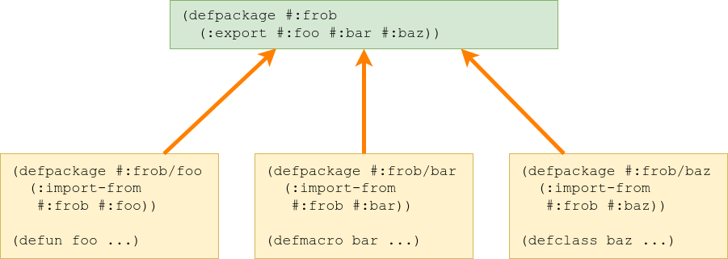

# `STATIC-LET`, Or How I Learned To Stop Worrying And Love `LOAD-TIME-VALUE`

## Introduction

So I have been working on Common Lisp Recipes, on a recipe for using global static bindings via [global-vars](https://github.com/lmj/global-vars). I was wondering if there was anything for *local* bindings though, something like in C:

```c
int test_function() {
  static int counter = 0;
  return counter++;
}

//test:
test_function(); // -> 0
test_function(); // -> 1
test_function(); // -> 2
```

And then, oh, I remembered. There was [an article](http://jacek.zlydach.pl/blog/2020-01-11-static-variables-in-common-lisp.html) exploring the topic and showing a technique that had some pretty nice syntax.

The only thing that was missing was a usable and somewhat tested implementation of that technique that I could link people to from the recipe. There wasn't one, though... So, d'oh, it needed to be written and uploaded somewhere.

Where? The library of [Serapeum](https://github.com/ruricolist/serapeum/) accepted the idea and I was able to come up with an [implementation](https://github.com/ruricolist/serapeum/pull/108) that satisfied the maintainer.

But, that's the boring stuff. Come! Let us indulge in a little bit of literate programming and figure out how exactly that code works.

## Package definition

Let's start with the very basics. A good thing with implementing `STATIC-LET` is that we do not need *anything* that is not a part of standard Common Lisp in order to make it work - which is both a testament to how good ANSI CL is and a relief when it comes to pedagogy (no external dependencies, no problem!).

```lisp
(defpackage #:serapeum/static-let
  (:use #:cl)
```

Still, it might be curious that we nonetheless import some symbols from Serapeum. In fact, these are symbols with the same names as the ones are supposed to define functionality for!

```lisp
  (:import-from #:serapeum
                #:static-let #:static-let*
                #:static-binding-flush-error
                #:flush-static-binding-group
                #:flush-all-static-binding-groups)
```

This is because we only import these symbols from Serapeum because we will *implement* them - that is, define new macros, condition types, functions named with these symbols, and therefore bring functionality to these symbols which are exported from Serapeum but do not yet have any useful "attached" to them.



This is an inverse of the "usual" package management style in which `SERAPEUM/STATIC-LET` would export symbols which export some functionality and then some other package would import and reexport them in turn.


Again, it's hard to say which of these styles is the "norm"; both of them have their uses and they're equivalent in theory even if they require different styles of arranging code.

We could probably also do all of our work in package `SERAPEUM` as long as we sacrificed some brevity of our helper utilities' names, but eh, let's promote the one-package-per-file style wherever it's possible.

```lisp
  #+sbcl (:implement #:serapeum))
```

Here's a SBCL-specific tidbit. SBCL implements the concept of *package locking* which is meant to prevent the specific thing that we are attempting to do here - meddling with a package's symbols from the outside. Serapeum makes use of that functionality and its package is locked on SBCL.

Here, however, meddling with Serapeum's symbols *is the whole point* of what we're trying to do - hence, we need to mark `SERAPEUM/STATIC-LET` as an *implementation package* for `SERAPEUM`. This allows us to define new functionality on Serapeum's symbols without tripping the package lock.

```lisp
(in-package #:serapeum/static-let)
```

We're all set package-wise, then; let's go!

## Static binding structure

The code from the original article uses a cons cell rather than a whole structure, and also does not recognize between an uninitialized binding and an initialized binding with the value of `NIL`. It also isn't safe against the situation of multiple threads attempting to initialize the binding at the same time.

To fix that, we'll implement each static binding as a structure with three slots: the value (obviously), a boolean stating whether a binding has been initialized, and an optional lock for bindings which should work in a multithreaded environment. We don't need a copier or a predicate and, since we're in our own package, we can ignore prefixes for accessors.

```lisp
(defstruct (static-binding (:constructor %make-static-binding)
                           (:copier nil)
                           (:predicate nil)
                           (:conc-name #:||))
  (value nil :type t)
  (initializedp nil :type boolean)
  (lock nil :read-only t :type (or null bt:lock)))
```

A keen eye will notice that we've defined a private constructor, `%MAKE-STATIC-BINDING`: that is because we want to make the lock optional (depending on the value of a constructor argument) and later conditionalize our code based on whether the lock exists (and the lock should therefore be acquired before proceeding with modifying the binding).

```lisp
(defun make-static-binding (&key once)
  (%make-static-binding
   :lock (if once (bt:make-lock "Static binding lock") nil)))
```

## Flush error

The original article describes a particular trait of static bindings: their values are effectively inaccessible from the outside. The values become an integral part of the code which uses them, similarly to when one uses a closure. (In fact, using closures is one of the alternative approaches of implementing a static binding described in the original article!)

This behavior is useful for e.g. static data which is meant for persist across deploying a Lisp application by saving the Lisp image and restoring it later, but it's unnecessary for e.g. any kind of caches that such static values might be used for: they will unnecessarily inflate the size of the binary and should instead be re-instantiated when the image is restored.

This means that we need some way to be able to flush these bindings from the outside. And such an operation is dangerous, because it's essentially equivalent to being able to pull the rug from under a series of threads that may be currently standing on it.

So, we need the ability to signal an error to raise the programmer's awareness about this danger, and to make the error continuable if the programmer decides that this is what they want.

Let's get to work, then!

```lisp
(define-condition static-binding-flush-error (error)
  ((group :initarg :group
          :reader static-binding-flush-error-group)
   (all-groups-p :initarg :all-groups-p
                 :reader static-binding-flush-error-all-groups-p))
  (:default-initargs :group nil :all-groups-p nil)
  (:report report-static-binding-flush-error))
```

We need to be able to pass two bits of information along with the condition. One is the *group* that a binding is a part of (if the user wants to flush just a single group of bindings), the other is whether the user instead wants to flush bindings for *all* groups - including, possibly, the ones that they didn't define themself.

We use two slots instead of overloading just a single slot in order to follow [Pitman's Two-Bit Rule](http://www.nhplace.com/kent/PS/EQUAL.html):

>     ``If you have two bits of information to represent,
>        use two bits to represent it.
>      Neither coincidence nor convenience 
>        justifies overloading a single bit.''
>
>                -- Pitman's Two-Bit Rule

We need a report for that condition, and a report for the `CONTINUE` restart that will need to be established around it. Let's start with a useful helper that we'll use in both of them.

```lisp
(defun report-static-binding-flush-error-substring (condition)
  (format nil "~:[static bindings from group ~S~;ALL static bindings~]"
          (static-binding-flush-error-all-groups-p condition)
          (static-binding-flush-error-group condition)))
```

The strings "static bindings from group ~S" and "ALL static bindings" will be useful both in the error report and the report for the `CONTINUE` restart that we will want to establish, hence this function was factored out to avoid code duplication.

```lisp
(defun report-static-binding-flush-error (condition stream)
  (let ((substring (report-static-binding-flush-error-substring condition)))
    (format stream
            "Requested to flush all values for ~A and ~
             to restore them to their uninitialized state.~@
             This operation is unsafe to perform while any other ~
             threads are trying to access these bindings.~:[~@
             Remove this error message with :ARE-YOU-SURE-P T.~;~]"
            substring
            (static-binding-flush-error-all-groups-p condition))))
```

```lisp
(defun flush-bindings-cerror (&key group all-groups-p)
  (let* ((condition (make-condition 'static-binding-flush-error
                                     :group group :all-groups-p all-groups-p))
         (continue-string
           (format nil "Flush values for ~A."
                   (report-static-binding-flush-error-substring condition))))
    (cerror continue-string condition)))
```

## Flushing - variables

```lisp
(defvar *flushing-lock* (bt:make-lock "Static binding flushing lock"))

(defvar *flushable-bindings* (make-hash-table))
```

## Flushing - mechanisms

```lisp
(defun %flush (group)
  (let ((count 0))
    (dolist (pointer (gethash group *flushable-bindings*))
      :start
      (let ((binding (tg:weak-pointer-value pointer)))
        (when (null binding)
          (go :start))
        (if (lock binding)
            (bt:with-lock-held ((lock binding))
              (setf (initializedp binding) nil
                    (value binding) nil))
            (setf (initializedp binding) nil
                  (value binding) nil))
        (incf count)))
    (setf (gethash group *flushable-bindings*) '())
    count))
```

```lisp
(defun flush-static-binding-group (group &key are-you-sure-p)
  (let ((thread-count (length (bt:all-threads))))
    (unless (or (= 1 thread-count) are-you-sure-p)
      (flush-bindings-cerror :group group)))
  (bt:with-lock-held (*flushing-lock*)
    (%flush group)))
```

```lisp
(defun flush-all-static-binding-groups ()
  (let ((thread-count (length (bt:all-threads))))
    (unless (= 1 thread-count)
      (flush-bindings-cerror :all-groups-p t)))
  (bt:with-lock-held (*flushing-lock*)
    (let ((result 0))
      (flet ((flush (key value)
               (declare (ignore value))
               (incf result (%flush key))))
        (maphash #'flush *flushable-bindings*)
        result))))
```

```lisp
(pushnew 'flush-all-static-binding-groups uiop:*image-dump-hook*)
```
## Binding canonicalizer

```lisp
(deftype variable-name () '(and symbol (not (satisfies constantp))))
```

```lisp
(defun canonicalize-binding (binding)
  ;; Returns a list of seven elements:
  ;; * user-provided name
  ;; * initform
  ;; * type
  ;; * gensym for holding a reference to the actual load-time-value binding
  ;; * boolean stating if the evaluation of initform should be synchronized
  ;; * boolean stating if the binding should be flushable
  ;; * object naming the flushing group
  (let (name
        (value nil)
        (type 't)
        (gensym (gensym "STATIC-LET-BINDING"))
        (once nil)
        (flush t)
        (in '*package*))
    (etypecase binding
      ;; VAR
      (variable-name
       (setf name binding))
      ;; (VAR)
      ((cons variable-name null)
       (setf name (first binding)))
      ;; (VAR VALUE)
      ((cons variable-name (cons t null))
       (setf name (first binding)
             value (second binding)))
      ;; (VAR VALUE &KEY TYPE ONCE FLUSH IN)
      ((cons variable-name (cons t cons))
       (destructuring-bind (new-name new-value
                            &key
                              ((:type new-type) nil new-type-p)
                              ((:once new-once) nil new-once-p)
                              ((:flush new-flush) nil new-flush-p)
                              ((:in new-in) nil new-in-p))
           binding
         (setf name new-name
               value new-value)
         (when new-type-p (setf type new-type))
         (when new-once-p (setf once new-once))
         (when new-flush-p (setf flush new-flush))
         (when new-in-p (setf in new-in)))))
    (list name value type gensym once flush in)))
```

```lisp
(defmacro with-canonicalized-binding-accessors (() &body body)
  `(flet ((name (x) (elt x 0))
          (value (x) (elt x 1))
          (type (x) (elt x 2))
          (sym (x) (elt x 3))
          (once (x) (elt x 4))
          (flush (x) (elt x 5))
          (in (x) (elt x 6)))
     (declare (ignorable #'name #'value #'type #'sym #'once #'flush #'in))
     ,@body))
```

## Macro element generators

```lisp
(defun make-let-binding (x)
  (with-canonicalized-binding-accessors ()
    (let ((once (once x)))
      `(,(sym x) (load-time-value (make-static-binding :once ,once))))))
```

```lisp
(defun make-flusher (x)
  (with-canonicalized-binding-accessors ()
    (if (flush x)
        (let ((in (in x)))
          (alexandria:once-only (in)
            `(bt:with-lock-held (*flushing-lock*)
               ;; Remove all dead weak pointers that might
               ;; have already accumulated.
               (alexandria:deletef
                (gethash ,in *flushable-bindings*)
                nil :key #'tg:weak-pointer-value)
               ;; Push the new weak pointer into the list.
               (push (tg:make-weak-pointer ,(sym x))
                     (gethash ,in *flushable-bindings*)))))
        '())))
```

```lisp
(defun make-initform (x)
  (with-canonicalized-binding-accessors ()
    (let* ((sym (sym x))
           (body `(setf (value ,sym) ,(value x)
                        (initializedp ,sym) t))
           (flusher (make-flusher x)))
      (if (once x)
          `(unless (initializedp ,sym)
             (bt:with-lock-held ((lock ,sym))
               (unless (initializedp ,sym)
                 ,body
                 ,flusher)))
          `(unless (initializedp ,sym)
             ,body
             ,flusher)))))
```

```lisp
(defun make-macrolet-binding (x)
  (with-canonicalized-binding-accessors ()
    `(,(name x) (value ,(sym x)))))
```

```lisp
(defun make-type-declaration (x)
  (with-canonicalized-binding-accessors ()
    `(type ,(type x) ,(name x))))
```

```lisp
(defmacro with-parse-static-let-variables ((bindings-var body-var) &body body)
  `(let* ((bindings (mapcar #'canonicalize-binding ,bindings-var))
          (let-bindings (mapcar #'make-let-binding bindings))
          (initforms (mapcar #'make-initform bindings))
          (macrolet-bindings (mapcar #'make-macrolet-binding bindings))
          (type-declarations (mapcar #'make-type-declaration bindings)))
     (multiple-value-bind (real-body declarations)
         (alexandria:parse-body ,body-var)
       ,@body)))
```

```lisp
(defun parse-static-let (bindings body)
  (with-parse-static-let-variables (bindings body)
    `(let (,@let-bindings)
       ,@initforms
       (symbol-macrolet (,@macrolet-bindings)
         (declare ,@type-declarations)
         ,@declarations
         ,@real-body))))
```

```lisp
(defun parse-static-let* (bindings body)
  (with-parse-static-let-variables (bindings body)
    `(let* (,@let-bindings)
       (symbol-macrolet (,@macrolet-bindings)
         (declare ,@type-declarations)
         ,@declarations
         ,@initforms
         ,@real-body))))
```

```lisp
(defmacro static-let ((&rest bindings) &body body)
  (parse-static-let bindings body))

(defmacro static-let* ((&rest bindings) &body body)
  (parse-static-let* bindings body))
```

Download the freshest version of Serapeum and enjoy your `STATIC-LET`!

*(Thanks for making it to the very end. If you like my writing, feel free to drop me a [line](mailto:phoe@disroot.org) or toss me a [coin](https://github.com/sponsors/phoe/).)*
